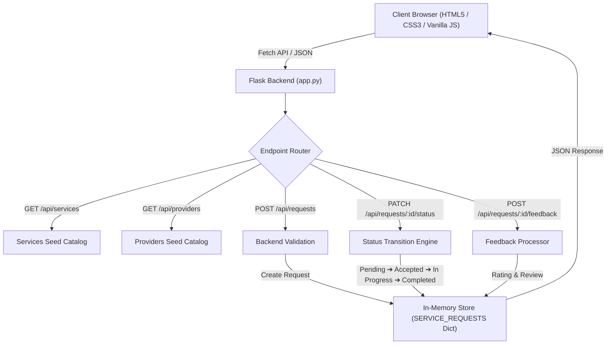

# Quick Serve — Local Service Request & Provider Platform

> **"Local services. Quick solutions."**

Quick Serve is a lightweight, modern web platform that allows users to discover local service providers (electricians, plumbers, cleaners, AC repairers, etc.), submit service requests, track live request status through a visual timeline, and submit feedback upon completion. 

Built with **HTML5, CSS3, Vanilla JavaScript, Python 3, and Flask**. Operates entirely **without an external database** using Python runtime in-memory data structures.

---

## 🏗️ System Architecture



---

## ✨ Features

- ⚡ **8 Service Categories:** Electrical, Plumbing, Cleaning, AC Repair, Appliance Repair, Carpentry, Computer Repair, and Painting.
- 🔍 **Provider Search & Filtering:** Filter local providers by rating, availability, and category in real time.
- 📋 **Instant Request Booking:** Form validation with auto-generated sequential IDs (e.g. `QS1001`).
- 📍 **Visual Status Timeline:** Live tracking stage progression (`Pending` ➔ `Accepted` ➔ `In Progress` ➔ `Completed` / `Cancelled`).
- 📊 **Provider & Customer Dashboard:** Real-time summary stat widgets and interactive status transition controls.
- ⭐ **5-Star Feedback System:** Customer ratings and reviews strictly enabled for completed services.

---

## 🛠️ Tech Stack

- **Frontend:** HTML5, CSS3 (Flexbox/Grid/Variables), Vanilla JavaScript (ES6+), Fetch API
- **Backend:** Python 3, Flask
- **Storage:** Python In-Memory Collections (`dict` / `list`) — *No external database required*

---

## 📁 Project Structure

```text
quickserve/
├── app.py                  # Flask server, API routes & in-memory state
├── requirements.txt        # Python dependencies (Flask)
├── .gitignore              # Files ignored from Git tracking
├── README.md               # Project documentation
├── templates/              # Jinja2 HTML views
│   ├── base.html           # Master layout template
│   ├── index.html          # Landing home page
│   ├── services.html       # Service categories catalog
│   ├── providers.html      # Provider search & listing
│   ├── request.html        # Booking form
│   ├── tracking.html       # Status timeline tracking
│   ├── dashboard.html      # Requests dashboard
│   └── feedback.html       # Customer rating form
└── static/
    ├── css/style.css       # SaaS design system
    ├── js/app.js           # Client-side API & UI logic
    └── assets/favicon.svg  # Vector logo favicon
```

---

## 🚀 How to Run Locally

1. **Clone the repository:**
   ```bash
   git clone <YOUR_REPOSITORY_URL>
   cd quickserve
   ```

2. **Create & activate a virtual environment:**
   ```bash
   # Windows (PowerShell)
   python -m venv venv
   .\venv\Scripts\Activate.ps1

   # macOS / Linux
   python3 -m venv venv
   source venv/bin/activate
   ```

3. **Install dependencies:**
   ```bash
   pip install -r requirements.txt
   ```

4. **Start the Flask server:**
   ```bash
   python app.py
   ```

5. **Open in Browser:**
   Go to `http://127.0.0.1:5000`

---

## 📡 API Endpoints

| Method | Endpoint | Description |
| :--- | :--- | :--- |
| `GET` | `/api/services` | Get all 8 service categories |
| `GET` | `/api/providers` | Get all providers (supports filtering) |
| `GET` | `/api/providers/<service_id>` | Get providers by service category |
| `GET` | `/api/requests` | Get all requests and dashboard stats |
| `GET` | `/api/requests/<request_id>` | Get single request details by ID |
| `POST` | `/api/requests` | Submit a new service request |
| `PATCH` | `/api/requests/<request_id>/status` | Update status (`Pending` ➔ `Accepted` ➔ `In Progress` ➔ `Completed`) |
| `POST` | `/api/requests/<request_id>/feedback` | Submit 5-star rating & review |

---

## 🔒 Files & Security Notice for GitHub

When pushing this project to GitHub:
- **`venv/` directory:** Do **NOT** upload to GitHub (already excluded in `.gitignore`). Anyone cloning can recreate it using `pip install -r requirements.txt`.
- **`__pycache__/` directory:** Do **NOT** upload (already excluded in `.gitignore`).
- **`scratch/` directory:** Do **NOT** upload temporary test files (already excluded in `.gitignore`).
- **No API keys / Secrets:** This project uses runtime memory only and has no secret API keys, database credentials, or passwords hardcoded.

---

## 📜 License

© 2026 X Crush. All rights reserved.
